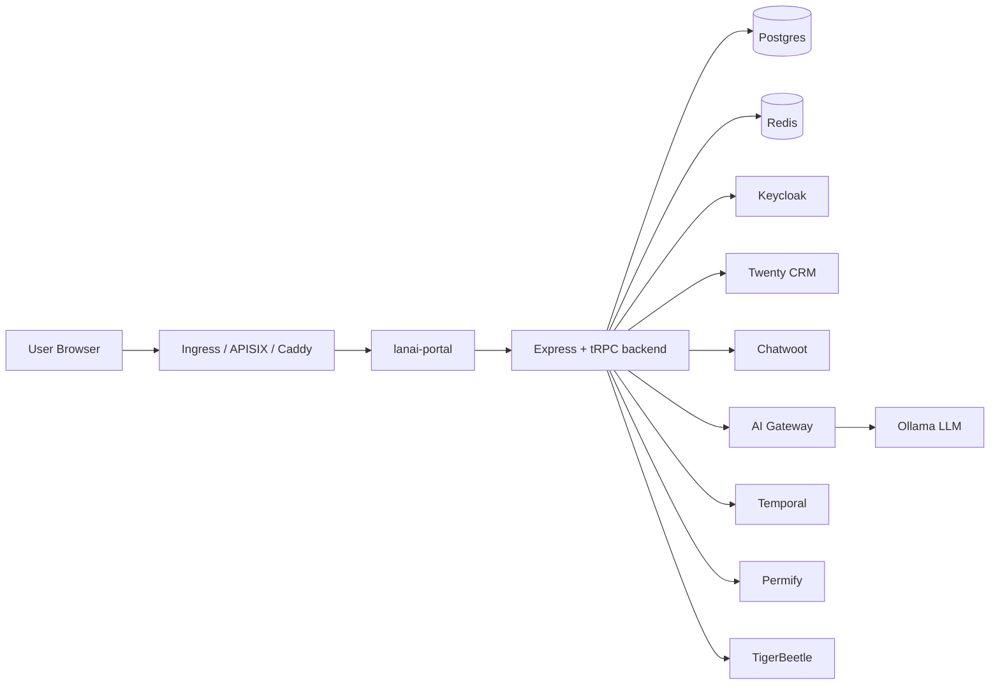

# Lanai Repository Map

This document is a practical navigation guide for the repository. It shows the main areas of the codebase, the runtime flow, and the key files to open first when working on the platform.

## 1. Repository at a glance

The repository is organized around a central portal application and a supporting AI/service layer.

## 2. High-level component map

### A. Application UI
- `lanai-portal/`
  - Main React + Vite frontend and Express backend.
  - This is the primary app developers will spend time in.
  - The portal handles the CRM dashboard, client portal, AI proposal flows, and messaging workflows.

### B. AI service layer
- `lanai_ai/`
  - Python/Flask-style AI microservices.
  - This layer powers proposal generation, client intelligence, briefing, WhatsApp triage, and Chatwoot AI bridging.

### C. Infrastructure and deployment
- `config/`
  - Kubernetes manifests and shared platform configuration.
  - Includes ingress, Keycloak, Postgres, AI tier, and service wiring.

### D. Presentation and planning docs
- `lanai_recommendations_presentation/`
  - HTML slide deck for architecture/recommendation storytelling.
- `*.md` root docs
  - Implementation, deployment, audit, and handoff documents for product and ops context.

## 3. Where to start

If you are new to the repo, open these files in this order:

1. [README.md](README.md)
   - Product overview and the best broad introduction.

2. [lanai-portal/package.json](lanai-portal/package.json)
   - Scripts, dependencies, build/test entrypoints.

3. [lanai-portal/vite.config.ts](lanai-portal/vite.config.ts)
   - Local dev proxy map for CRM and AI service routes.

4. [lanai-portal/server/_core/index.ts](lanai-portal/server/_core/index.ts)
   - Main backend boot entrypoint.
   - Registers express routes, proxy handlers, tRPC, and webhooks.

5. [config/k8s/app-tier.yaml](config/k8s/app-tier.yaml)
   - Production runtime dependencies and service-to-service wiring.

6. [config/k8s/ai-tier.yaml](config/k8s/ai-tier.yaml)
   - AI gateway and Ollama deployment connection points.

## 4. Navigation by feature area

### Frontend pages
The main React UI lives under:
- `lanai-portal/client/src/pages/`

Typical feature entrypoints include:
- Dashboard pages
- Clients / CRM overview
- Travel request pipeline
- Members management
- Proposal engine
- Client portal login and dashboard

### Shared UI and app logic
- `lanai-portal/client/src/components/`
- `lanai-portal/shared/`
- `lanai-portal/server/`

These contain the reusable UI pieces, shared contracts, server route modules, workflows, and provider integrations.

### AI routes and services
- `lanai_ai/`
- `lanai-portal/server/_core/aiRoutes.ts`
- `lanai-portal/server/_core/chatwootProxy.ts`
- `lanai-portal/server/_core/crmProxy.ts`

These are the central points where the portal talks to AI and CRM integrations.

### Deployment and runtime integration
- `config/k8s/`
- `config/apisix/`
- `config/caddy/`
- `docker-compose.yml`

These define how the application is deployed, exposed, and connected to shared services.

## 5. Main runtime connections

### Local development connections
The frontend dev server proxies API traffic like this:

- `/api/proposals` -> proposal AI service
- `/api/intelligence` -> intelligence AI service
- `/api/briefing` -> briefing AI service
- `/api/whatsapp` -> WhatsApp AI service
- `/crm` -> Twenty CRM

### Production / Kubernetes connections
The portal container depends on:

- Postgres
- Redis
- Keycloak
- Permify
- Temporal
- Dapr state / pubsub
- TigerBeetle
- Fluvio
- AI gateway
- External CRM / Chatwoot integrations

The AI gateway then connects to Ollama, which is the LLM runtime.

## 6. Recommended exploration order by task

### If you are working on the UI
- `lanai-portal/client/src/pages/`
- `lanai-portal/client/src/components/`
- `lanai-portal/vite.config.ts`

### If you are working on backend APIs
- `lanai-portal/server/_core/index.ts`
- `lanai-portal/server/routers/`
- `lanai-portal/server/_core/aiRoutes.ts`
- `lanai-portal/server/_core/crmProxy.ts`

### If you are working on AI functionality
- `lanai_ai/`
- `config/k8s/ai-tier.yaml`
- `lanai-portal/server/_core/aiRoutes.ts`

### If you are working on deployment / infra
- `config/k8s/`
- `config/apisix/`
- `docker-compose.yml`
- `config/kustomization.yaml`

## 7. Key things to know

- `lanai-portal/` is the main repo application and the best place to start for code changes.
- `lanai_ai/` is an auxiliary service layer that provides AI-specific endpoints and inference.
- `config/k8s/` is the deployment truth for cluster runtime relationships.
- `docker-compose.yml` is a useful local topology reference, but the Kubernetes manifests show the current production shape more clearly.

## 8. One-sentence repo summary

The repository is a multi-service travel intelligence platform where the React/Vite portal acts as the central app shell, the backend coordinates CRM and AI features, and the infrastructure layer connects the app to Postgres, Redis, authentication, workflows, and Ollama-backed AI services.
