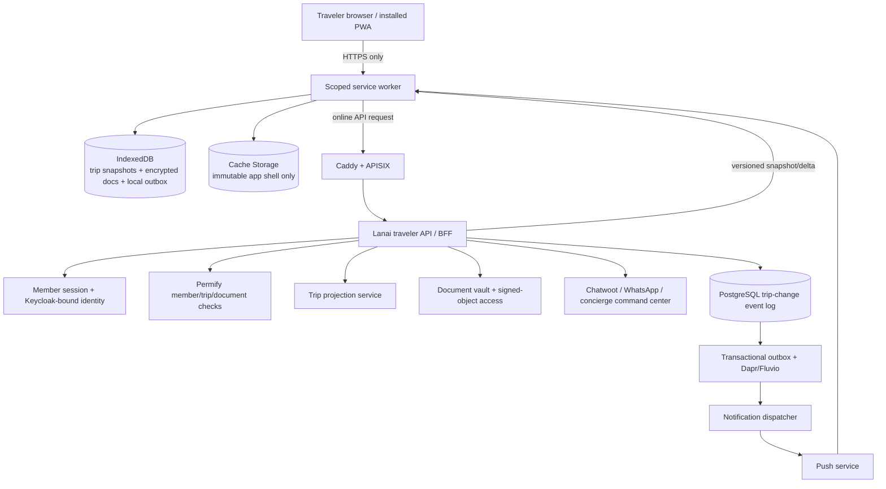

# Traveler Experience PWA: Architecture and Offline-Caching Blueprint

**Prepared:** 2026-08-22

**Objective:** Turn Lanai’s existing member portal, trip timeline, booking, proposal, document-vault, communication, and concierge workflow capabilities into an installable **Traveler Experience PWA** that remains useful during unreliable connectivity without storing unbounded or unnecessarily sensitive travel data on a device.

> **Architectural rule:** The PWA is a **read-optimized, trip-scoped client**. PostgreSQL and Lanai’s existing operational services remain authoritative. Offline data is an explicitly selected, revocable snapshot—not a second system of record.

## 1. Product scope and trust boundaries

The first release should support a traveler before and during an active trip: an itinerary timeline, booking/service confirmations, selected documents, concierge contacts, trip alerts, a request-for-help flow, and change acknowledgements. It should not permit offline money movement, offline booking confirmation, offline document upload, or direct editing of core booking/financial records.

| User capability | Online | Offline | Control boundary |
|---|---|---|---|
| View selected trip itinerary and service details | Yes | Yes, after explicit download | Trip-scoped snapshot; visibility policy checked server-side before issue |
| View designated documents | Yes | Yes only when traveler elects to save them | Per-document eligibility, size limit, expiry, local encryption, purge on logout |
| View concierge contacts and emergency instructions | Yes | Yes | Minimal emergency pack, expires at trip end plus grace period |
| Read trip-change notices | Yes | Most recent downloaded notices | Signed snapshot and sequence number; clear stale indicator |
| Ask concierge for assistance | Yes | Queue intent only | Local outbox; server confirms upon reconnect; no implied delivery while offline |
| Acknowledge an itinerary change | Yes | Queue idempotent acknowledgement | Server validates traveler, trip, and event version |
| Make payment, approve supplier charge, edit booking | Yes, separate authenticated journey | No | Never cache payment data or make financial state offline-writeable |

The PWA must remain a separate origin/path and service-worker scope from advisor/admin tooling. The recommended deployment is `traveler.<lanai-domain>` or `/traveler/` with a service worker confined to that scope. Service workers act as network proxies and can intercept/cache in-scope requests, which makes scope a security boundary rather than merely a deployment detail.[1] [2]

## 2. Logical architecture



The Traveler API is a dedicated backend-for-frontend (BFF), not a direct exposure of internal tRPC procedures. It aggregates only traveler-visible fields from the existing `members`, `travelRequests`, `bookings`, `documents`, `tripTimeline`, proposals, communications, and notification projections. This prevents the offline client from learning advisor notes, supplier margin, commission, internal status, or operational metadata.

## 3. Server-side component design

| Component | Responsibility | Implementation direction |
|---|---|---|
| `travelerRouter` / BFF | Exposes trip summary, versioned snapshot, incremental delta, offline-pack manifest, change acknowledgement, concierge intent, device registration, and logout-revocation endpoints | New protected API surface using the existing member identity context and member/trip authorization checks |
| Trip projection | Produces a stable traveler view from bookings, proposal items, timeline, documents, and approved communication events | Read model optimized by `tripId`, `memberId`, `snapshotVersion`; never derive client display directly from raw financial tables |
| Trip change event log | Records immutable traveler-visible changes—schedule, confirmation, venue, document, concierge notice, cancellation—with event ID and monotonically increasing sequence | New append-only `traveler_trip_events` table; publish through the existing transactional outbox |
| Snapshot builder | Builds signed, canonical snapshot JSON and an offline-package manifest | Deterministic JSON serialization; snapshot payload hash and server ETag; stores a policy/version stamp |
| Document access service | Grants bounded access to eligible files and creates download manifest entries | Reuse object storage; enforce document visibility, type allowlist, expiry, trip scope, and size limits |
| Device registry | Stores push subscription, device/install ID, member, scope, consent, last-seen, and revocation status | New `traveler_device_subscriptions` table; encrypt push endpoint material at rest if required by provider |
| Notification dispatcher | Converts traveler-visible outbox events into web-push notifications and in-app notices | Idempotent delivery by `(event_id, device_id, notification_type)`; notification body contains no sensitive details |
| Offline command endpoint | Validates queued acknowledgements and help requests after reconnect | Requires `clientOperationId`, trip ID, snapshot/event version, and device/session authentication |

### 3.1 Snapshot contract

Use a **snapshot plus delta** model rather than synchronizing every domain table. A current active trip receives a canonical snapshot such as:

```ts
export type TravelerTripSnapshot = {
  schemaVersion: 1;
  snapshotVersion: number;
  tripId: string;
  memberId: number;
  generatedAt: string;
  expiresAt: string;
  integrity: { sha256: string; keyId: string; signature: string };
  trip: {
    title: string;
    destinationSummary: string;
    startAt: string;
    endAt: string;
    timezone: string;
    status: "upcoming" | "active" | "completed" | "cancelled";
  };
  itinerary: TravelerItineraryItem[];
  documents: TravelerDocumentManifest[];
  concierge: { displayName: string; supportChannels: TravelerSupportChannel[] };
  notices: TravelerNotice[];
  emergency: TravelerEmergencyPack;
  policy: { offlineAllowed: boolean; cacheUntil: string; restrictedReason?: string };
};
```

The endpoint should support `If-None-Match`/ETag and a cursor:

| Endpoint | Purpose | Response contract |
|---|---|---|
| `GET /api/traveler/trips` | List eligible trips | Minimal cards only; no documents or internal data |
| `GET /api/traveler/trips/:tripId/snapshot` | Obtain a complete current traveler snapshot | `200` snapshot, `304` unchanged, or `403/404` fail closed |
| `GET /api/traveler/trips/:tripId/delta?after=:sequence` | Obtain visible events since a known sequence | Ordered immutable events and next sequence; force snapshot when cursor is too old |
| `GET /api/traveler/trips/:tripId/offline-pack` | Obtain manifest of user-selected cacheable resources | Manifest only; no bulk server download through a single opaque archive |
| `POST /api/traveler/operations` | Submit queued acknowledgement/help intents | Idempotent result keyed by `clientOperationId` |
| `POST /api/traveler/devices` | Register/renew push subscription | Explicit consent and revocation support |
| `POST /api/traveler/logout` | Revoke current device grant | Returns a purge instruction and invalidates device session/refresh capability |

The BFF must authorize each request through the member session plus a relation proving that the member is associated with the requested trip and that each document is member-visible. Record authorization decisions in the audit stream, but never include authorization metadata in the offline snapshot.

## 4. Client structure

```text
client/src/traveler/
  app/                 # PWA routes: trips, itinerary, documents, help, notices
  api/                 # authenticated BFF client, ETag and delta handling
  offline/
    db.ts              # versioned IndexedDB schema
    crypto.ts          # Web Crypto envelope/key derivation adapter
    snapshotStore.ts   # snapshot verification and atomic persistence
    documentStore.ts   # manifest-driven encrypted document cache
    operationOutbox.ts # idempotent queued user intents
    sync.ts            # reconnect/background-sync reconciliation
    cachePolicy.ts     # resource allow/deny and quota enforcement
  push/                # consent, device registration, notification handling
  service-worker.ts    # Workbox/Vite PWA service worker entry
  security/            # logout purge, device revoke, idle lock integration
```

Use the existing React/Vite stack and add `vite-plugin-pwa`/Workbox for build-time precaching. Avoid treating Workbox defaults as policy; configure explicit runtime strategies and deny patterns. The service worker must be a static module with no dynamic imports, because dynamic module import is not available in the service-worker global scope.[1]

## 5. Offline storage model

Cache Storage and IndexedDB have different roles. Cache Storage is for URL-addressable application resources; IndexedDB is for structured snapshot data, manifest state, encrypted binary blobs, and queued operations. Both offer asynchronous persistent storage useful to PWAs; IndexedDB supports structured data and binary blobs.[3]

### 5.1 IndexedDB stores

| Store | Key | Contents | Retention |
|---|---|---|---|
| `tripSnapshots` | `tripId` | Encrypted canonical snapshot, ETag, sequence, schema version, expiry, integrity metadata | Delete at expiry, logout, access revocation, or 30-day inactivity; default expiry trip end + 72 hours |
| `tripEvents` | `[tripId, sequence]` | Recent traveler-visible deltas | Bound by snapshot sequence and retention window; compact after snapshot update |
| `documentManifest` | `documentId` | Eligibility, MIME type, size, hash, expiry, local-download status | Remove with associated trip/policy expiry |
| `documentBlobs` | `documentId` | Encrypted blob chunks; no raw URL | User selected only; per-file and per-device quota |
| `operationOutbox` | `clientOperationId` | Intent type, payload, base sequence, retry metadata, display state | Remove only after server receipt; dead-letter after explicit user-visible failure |
| `deviceState` | `deviceId` | Non-secret device ID, last successful sync, consent state, current key version | Clear at logout/revocation |
| `telemetryQueue` | event ID | Privacy-minimized client telemetry | Bounded; best-effort delivery only |

Do not store bearer tokens, refresh tokens, payment data, raw private advisor notes, supplier rates, commission fields, full message histories, or unredacted passport/payment scans in Cache Storage. Avoid `localStorage` for this architecture; it is synchronous, unavailable to service workers, and inappropriate for this volume/sensitivity.[3]

### 5.2 Device-side encryption

Browser offline storage is not a hardware security boundary. The PWA should reduce exposure through defense in depth:

1. On successful member authentication, the server issues a short-lived **offline package key envelope** bound to `(memberId, deviceId, sessionId, policyVersion)`.
2. The client creates a non-extractable AES-GCM content-encryption key through Web Crypto and stores encrypted snapshot/document records in IndexedDB.
3. The server envelope only enables use while the session and offline policy are valid. If browser capabilities cannot support the chosen envelope/key handling, permit text-only snapshot caching and disable document download.
4. The PWA locks after inactivity and requires an active member session or device-level biometric/PIN wrapper where the browser/OS supports it. This is convenience protection, not a replacement for server authorization.
5. Logout, server-side device revocation, trip cancellation, document expiry, and policy downgrade trigger `CLEAR_TRIP`/`CLEAR_ALL` messages to the service worker plus local IndexedDB deletion.

The product copy must state plainly that offline access stores selected trip information on the device and should only be enabled on a personal, protected device.

## 6. Service-worker cache policy

| Resource class | Strategy | Cache location | TTL / invalidation | Security rule |
|---|---|---|---|---|
| Hashed JS/CSS/fonts and icons | Cache-first, immutable | Cache Storage `traveler-shell-v{build}` | Build-version cleanup on activate | Only same-origin, build-hashed assets |
| HTML navigation shell | Network-first with offline fallback shell | Cache Storage | Short TTL; never cache authenticated HTML response | No user data in HTML |
| Public imagery/placeholders | Stale-while-revalidate | Cache Storage | LRU quota + asset version | Only allowlisted CDN/origin and non-sensitive assets |
| Traveler snapshot API | Network-first, then IndexedDB snapshot | IndexedDB | Version/ETag + expiry | Do not put authenticated JSON into Cache Storage |
| Delta API | Network-only online; persist validated events to IndexedDB | IndexedDB | Sequence compaction | Validate trip ID, schema, sequence, integrity |
| Documents | User-initiated fetch; encrypted storage after verification | IndexedDB blob store | Document expiry and size/quota policy | No cache of signed URL; enforce eligibility and MIME allowlist |
| Mutating endpoints | Network-only; enqueue explicit safe offline intent on failure | IndexedDB outbox | Retry with idempotency and expiry | Allow only acknowledgement/help/non-financial operations |
| Auth, logout, token, payment endpoints | Network-only | None | Never cache | Bypass service-worker cache entirely |

Service-worker lifecycle changes should be **user-mediated** during an active trip. A new worker may install in the background, but the app displays “Update ready—refresh after reviewing active trip information.” Do not force `skipWaiting()` while an unsent help request or operation outbox entry exists. Service workers can update in the background and old/new worker coexistence is normal; the update UX must protect active offline state.[1] [2]

## 7. Synchronization and conflict model

### 7.1 Read synchronization

1. On launch or foreground, retrieve `snapshot` with ETag.
2. If unchanged, read current IndexedDB snapshot immediately.
3. If changed, request deltas from the local sequence. Apply only contiguous events.
4. If an event gap, policy version mismatch, integrity failure, or schema mismatch is detected, discard deltas and fetch a new complete snapshot.
5. Persist snapshot/event updates atomically in one IndexedDB transaction, then broadcast `TRIP_UPDATED` to all open PWA clients.

### 7.2 Offline write synchronization

The local outbox is limited to safe operations such as `acknowledge_change`, `request_concierge_help`, `mark_document_viewed`, and a traveler-entered non-financial preference note. Every operation contains a UUID `clientOperationId`, `tripId`, `baseSnapshotVersion`, `createdAt`, and opaque payload.

The server is authoritative. It accepts a duplicate idempotency key as a successful replay, validates that the traveler is still entitled to the trip, and returns one of `accepted`, `already_applied`, `conflict`, `expired`, or `forbidden`. A conflict does not silently overwrite server state: the PWA displays the new current itinerary and preserves the traveler’s unsent draft for explicit re-submission.

Background Sync may improve delivery, but it is not a correctness requirement because support varies across platforms. Store small queued operations in IndexedDB, use a background-sync registration where available, and retry on app foreground/online events otherwise. Large document downloads must not use Background Sync; browsers may terminate service workers, and the platform guidance limits this mechanism to small data transfers.[4]

## 8. Push and change-notification design

Push notifications should be opt-in and trip-specific. A notification contains only a generic prompt, such as “Your Lanai trip has an update,” with a deep link carrying an opaque event identifier. The PWA fetches the current authorized event after opening. Never include hotel name, itinerary detail, passport/document title, or personal details in push payloads or lock-screen text.

| Event | Notification policy | Offline behavior |
|---|---|---|
| Critical same-day change | Push + in-app high priority; escalation to concierge workflow | Stored as a high-priority local notice after next sync |
| Booking/document update | Push only if traveler has consented; in-app badge | Snapshot/delta refresh on open |
| Concierge reply | Respect channel and notification preferences | Read via communication BFF when connected |
| Trip reminder | Scheduled server notification, not client timer | Do not rely on background/periodic sync for essential reminders |

## 9. Security, privacy, and operational controls

| Risk | Required control |
|---|---|
| Shared/lost device | Explicit offline opt-in, inactivity lock, encrypted local records, logout purge, server-side device revocation, limited default retention |
| Cache leakage | Cache shell only; authenticated JSON in IndexedDB; never cache auth/payment routes, signed URLs, or response headers containing secrets |
| Stale itinerary causes harm | Visible “last updated” state, expiry, sequence/version checks, critical-change push, mandatory online refresh for safety-critical service actions |
| Cross-member access | Trip/member policy check on every snapshot, document, delta, operation, and device API; no trust in client trip IDs |
| PWA supply-chain compromise | HTTPS only, strict CSP, immutable hashed assets, narrow service-worker scope, SRI where applicable, signed release/image chain, build provenance |
| Push data exposure | Generic payloads only, explicit consent, per-device revocation, rate limits, delivery audit |
| Offline queued action replay | UUID idempotency, expiry, operation allowlist, member/device authentication, transaction/audit record |
| Device storage exhaustion | Quota estimate before offline package, user-visible selection, LRU for non-sensitive imagery only, hard cap for documents, `navigator.storage.persist()` request after meaningful opt-in |

Persistent storage can reduce browser eviction but remains under user control. Request it only after a traveler installs the PWA and explicitly downloads an offline trip pack; monitor storage quota before caching. [3]

## 10. Delivery plan and acceptance gates

| Release | Scope | Exit criteria |
|---|---|---|
| R0 — Foundations | Separate traveler PWA shell, manifest, scoped service worker, trip BFF, versioned snapshot, secure session and audit model | Member cannot access another member’s trip; all auth/payment routes are network-only; browser offline test serves shell and safe snapshot |
| R1 — Offline itinerary | Snapshot download, itinerary/notice views, local expiry/stale indicator, delta sync, manual refresh | Airplane-mode trip view works; cancellation/revocation clears access; version-gap recovery tested |
| R2 — Documents and notifications | User-selected encrypted document cache, device registration, push, change acknowledgement | Document cache honors expiry/visibility; generic push payload; revoke/purge evidence; device quota handling |
| R3 — Concierge assistance | Safe local outbox, help request, acknowledgement, background-sync enhancement, command-center handoff | Idempotent delivery, conflict UX, no duplicate concierge case, browser fallback works without Background Sync |
| R4 — Experience enhancement | Maps/deep links, flight/disruption provider, localization, accessibility, optional native wrappers | Field test during an active trip; WCAG review; battery/network/low-storage test matrix |

Required test layers are unit tests for cache policy/crypto/outbox; service-worker tests for route allow/deny and update lifecycle; Playwright offline/throttled-network tests; mobile real-device tests; authorization tests; document expiry/revocation drills; push-payload inspection; and a staff-assisted live-trip pilot. No production deployment should claim offline support until airplane-mode, reconnect, revocation, and active-trip worker-update scenarios are proven on iOS Safari and Android Chrome.

## References

[1]: https://developer.mozilla.org/en-US/docs/Web/API/Service_Worker_API "MDN: Service Worker API"
[2]: https://web.dev/learn/pwa/service-workers "web.dev: Service workers"
[3]: https://web.dev/learn/pwa/offline-data "web.dev: Offline data"
[4]: https://learn.microsoft.com/en-us/microsoft-edge/progressive-web-apps/how-to/background-syncs "Microsoft Learn: PWA background synchronization"
