# Lanai Lifestyle User Guide

**Version 2.0** · *A comprehensive step-by-step guide for navigating and using the platform.*

Welcome! This guide walks you through the **Lanai Lifestyle** platform, one screen at a time, in simple everyday language. By the end you will be able to navigate the entire application, use every service, and understand what the AI is doing for you without needing to call anyone for help.

---

## 1. What is Lanai?

Lanai is a **luxury travel concierge** that lives on your computer. It helps a travel team run their business and helps members (the travellers) see and manage their trips in one place.

There are **two areas**, like two doors into the same building:

| Area | Who uses it | What it's for |
|------|-------------|---------------|
| **Advisor Portal** | The Lanai team | Run the business: clients, trips, proposals, AI assistance, invoices |
| **Member Portal** | The travellers (members) | See your trips, documents, proposals, and message your advisor |

The platform has an **AI assistant built in**. It helps write proposals, prepare daily briefings, understand clients, and draft replies to messages. Think of it as a fast assistant that drafts content for you to review before sending.

---

## 2. Logging In

### 2.1 Advisor Portal
1. Open your browser and go to the web address your team gave you (for example `https://lanai.newfire.app`).
2. Click the **Sign In** button.
3. You will be taken to a secure login page.
4. Type your **email** and **password**.
5. Click **Sign In** again to land on your **Dashboard**.

> If you forget your password, click the **"Forgot password"** link on the login page.

### 2.2 Member Portal
1. Go to the member link (usually ends in `/client`).
2. Type your **email** and your **PIN**.
3. You will land on your personal **Trip Dashboard**.

> First time? Your advisor sends you an invitation email with a link to set your PIN.

---

## 3. The Advisor Portal: Screen by Screen

The **left-hand menu** is your map. Click any item to move between screens. Below is every screen, what it's for, and how to use it.

### 3.1 Dashboard (Home Base)

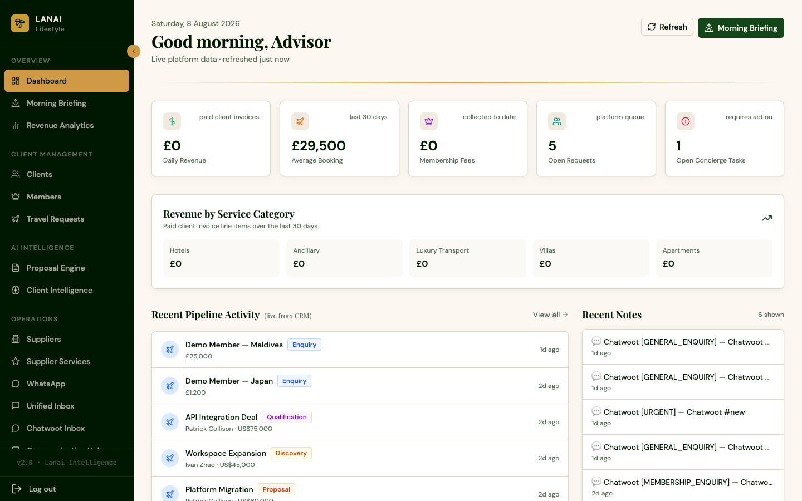

This is your **at-a-glance overview**. It shows live numbers pulled from your records:
- **Total clients**
- **Open travel requests** (trips people have asked for)
- **Active members**
- **Pipeline value** (the money in the works)

**How to use it:** Start here every day. It tells you what needs attention at a glance.

---

### 3.2 Clients (Client Directory)

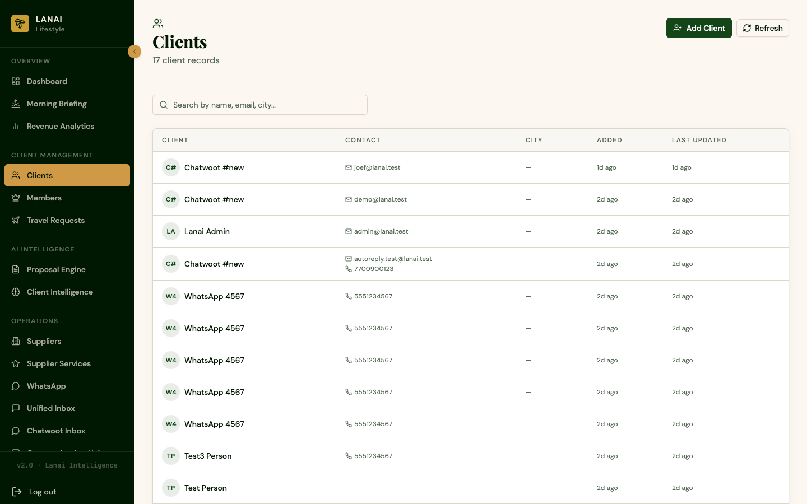

A searchable list of **every client**. 

**How to use it:**
1. Use the **search box** to find someone by name, email, or city.
2. Click the **Add Client** button to add a new person (fill in their name, email, phone, and notes).
3. See each client's contact details at a glance.

---

### 3.3 Members (Membership Base)

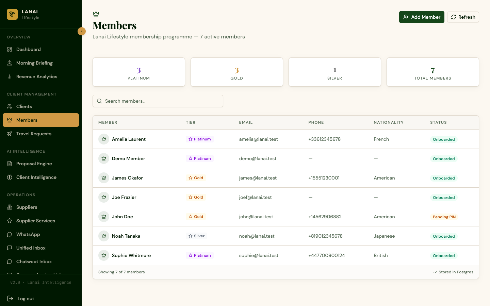

Your **active membership base**. Each member has a tier (Platinum, Gold, Silver) and status.

**How to use it:** See who your members are, their tier, and their details. Click into a member to see their profile and history.

---

### 3.4 Travel Requests (Trip Pipeline)

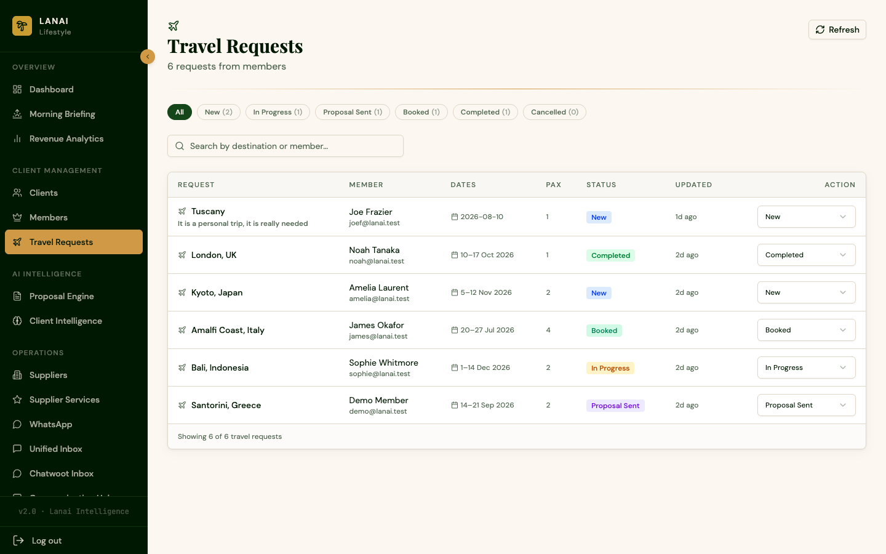

Every trip a client has asked for, from first request to completed booking.

**How to use it:**
1. **Search** by destination or member.
2. Use the **status buttons** at the top to filter (New, In Progress, Proposal Sent, Booked, Completed, Cancelled).
3. Use the **Update Status** dropdown on any row to move a request to its next stage.

> **What the stages mean:** New (just asked) → In Progress (being worked on) → Proposal Sent (you've sent them options) → Booked (confirmed) → Completed (trip done) → Cancelled.

---

### 3.5 Proposals (AI Co-Pilot)

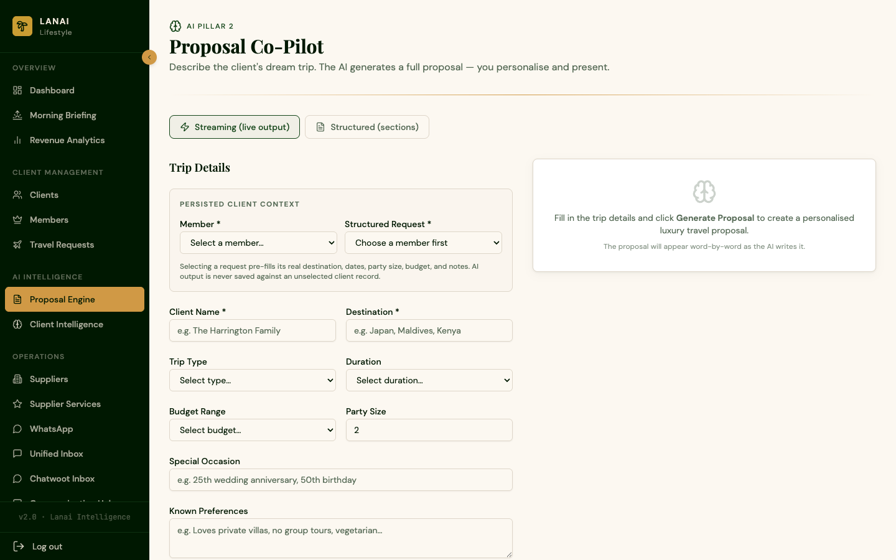

The **AI proposal generator**. Instead of writing a trip proposal from scratch, the AI drafts it for you.

**How to use it:**
1. Enter the client's details, including name, destination, dates, travellers, budget, and preferences.
2. Click **Generate**.
3. The AI writes a complete, client-ready proposal: accommodation, a day-by-day itinerary, experiences, estimated cost, and next steps.
4. **Review it, tweak it, and send it.**

> **A note on AI:** Generation can take a minute or two. The AI only uses the facts you give it and clearly labels any assumptions. It never invents confirmed prices or availability.

---

### 3.6 Intelligence (Client Insights)

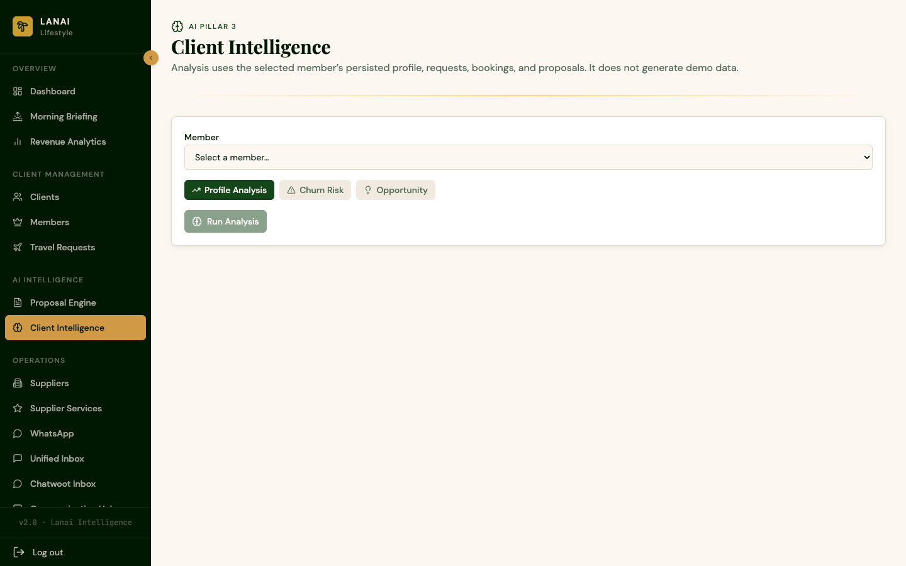

A per-member **client intelligence** view. Pick a member and the AI looks at their profile to surface:
- A summary of their travel history and preferences.
- Open opportunities (requests and proposals).
- Risks or gaps (for example, missing information to collect).

**How to use it:** Select a member, then read the AI's summary to get up to speed before you speak with them.

---

### 3.7 Morning Briefing (Daily Priorities)

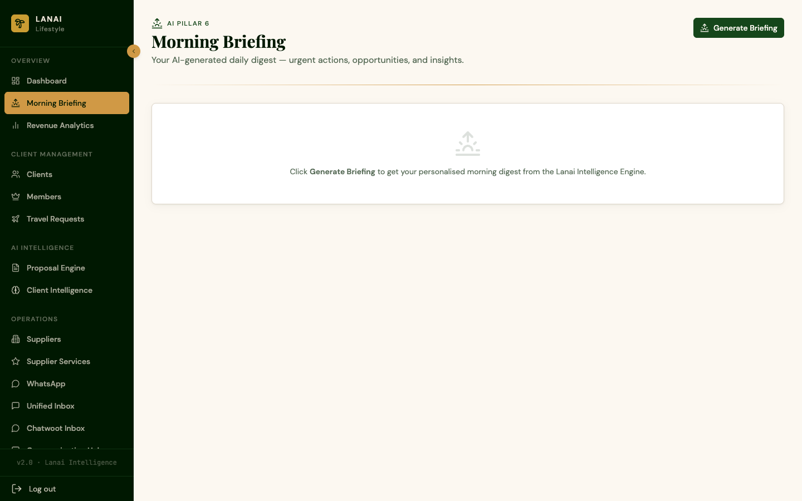

Generates a **daily briefing** with a digest of the day's clients, follow-ups, and priorities.

**How to use it:** Click **Generate Briefing**. The AI pulls together what matters for the day so you know where to focus. (This can take a minute or two.)

---

### 3.8 WhatsApp (AI Message Bridge)

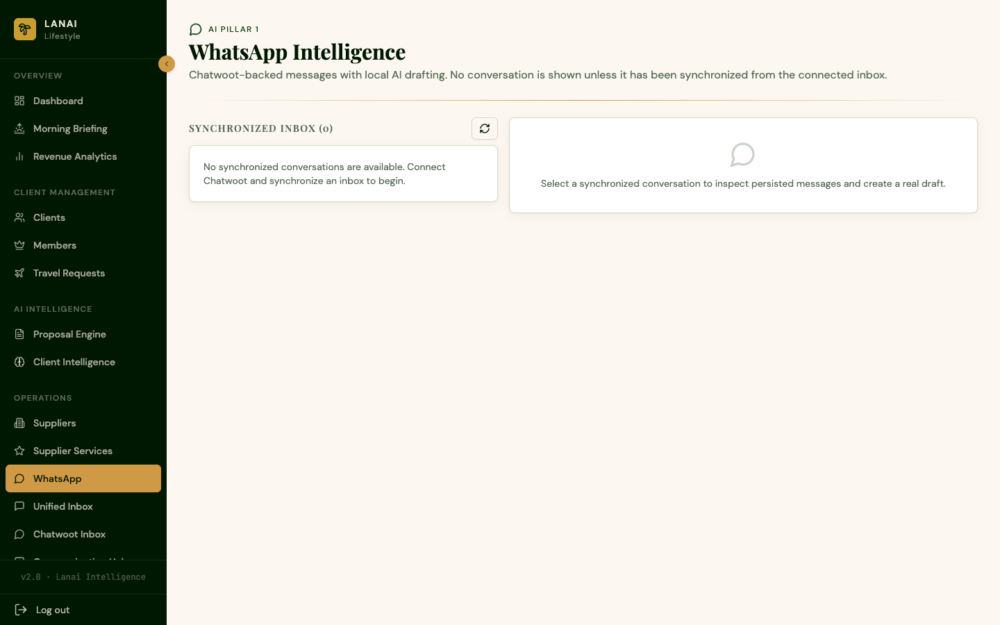

When a client messages you on WhatsApp, the platform:
1. **Recognises** the contact (and creates or updates them in your records).
2. Runs **AI triage** to determine the intent, urgency, and tone of the message.
3. **Drafts a reply** for you to review and send.
4. Logs a **note** and **task** against the client automatically.

**How to use it:** Open a message, review the AI's suggested reply, edit if you like, and send.

---

### 3.9 Inbox (Unified Messaging)

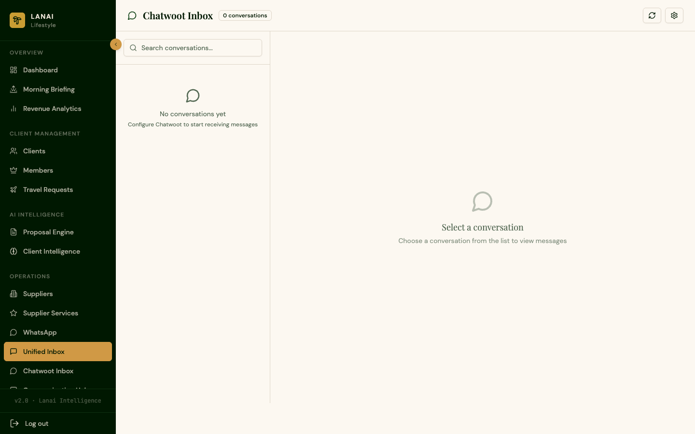

Your **unified messaging inbox** (powered by Chatwoot). All client conversations across WhatsApp, email, and portal messages in one place.

**How to use it:**
- See all conversations and who's assigned to them.
- Reply directly.
- Use the **AI Draft** button to get a suggested reply, then edit and send.

> **24/7 AI auto-reply:** When a member sends a message through the portal, the platform **replies automatically around the clock** so no message ever goes unanswered, even outside working hours. The AI reads the message (intent, urgency, mood) and sends a personal reply right away. If the AI is unavailable, it sends a warm acknowledgment and flags the conversation for you to follow up. Your manual replies always take priority, and the system never replies to its own messages.

---

### 3.10 Communication Hub (Client Overview)

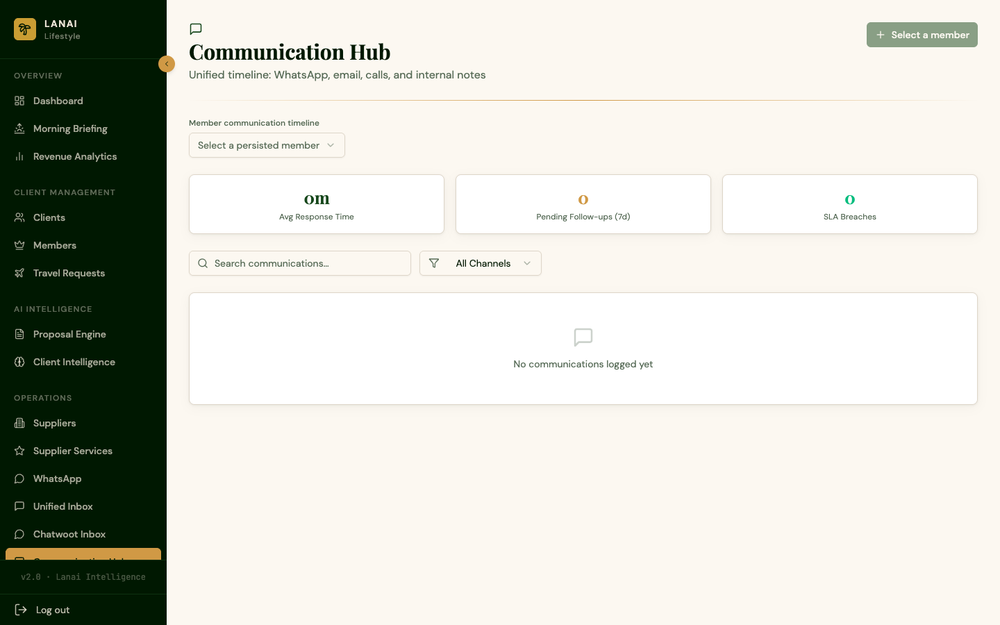

A unified view of a client's communications and activity to see the full picture of your relationship at a glance.

---

### 3.11 Analytics (Revenue & Pipeline)

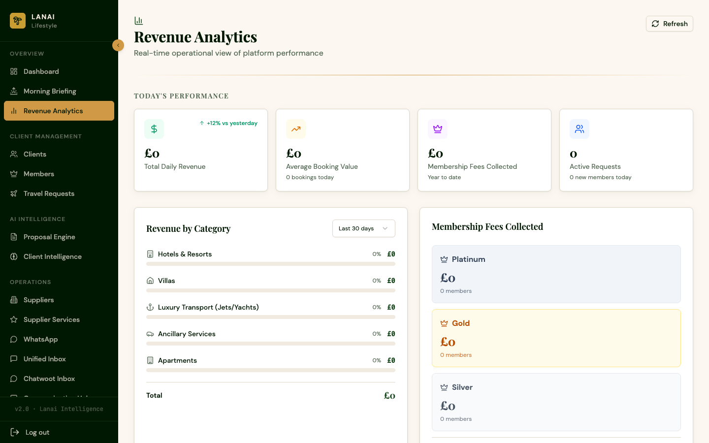

**Revenue analytics** showing income, commissions, and pipeline value to track business performance.

---

### 3.12 Invoicing (Billing & Commissions)

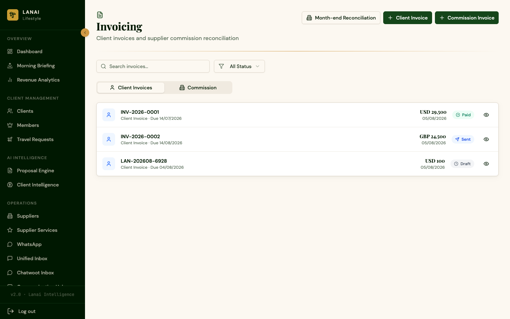

Create and manage **client invoices** and **supplier commission invoices**.

**How to use it:** Create an invoice and track its status (Draft, Sent, Paid, or Overdue) along with due dates.

---

### 3.13 Task Templates (Workflow Automation)

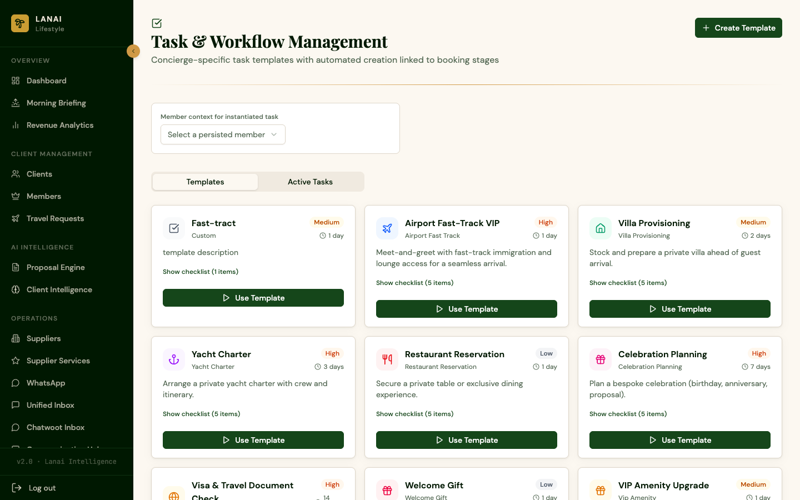

**Pre-made templates** for common tasks and workflows so you do not have to start from scratch each time.

**How to use it:** Pick a template, and it fills in the standard steps for you to adjust and use.

---

### 3.14 Suppliers (Vetted Partner Network)

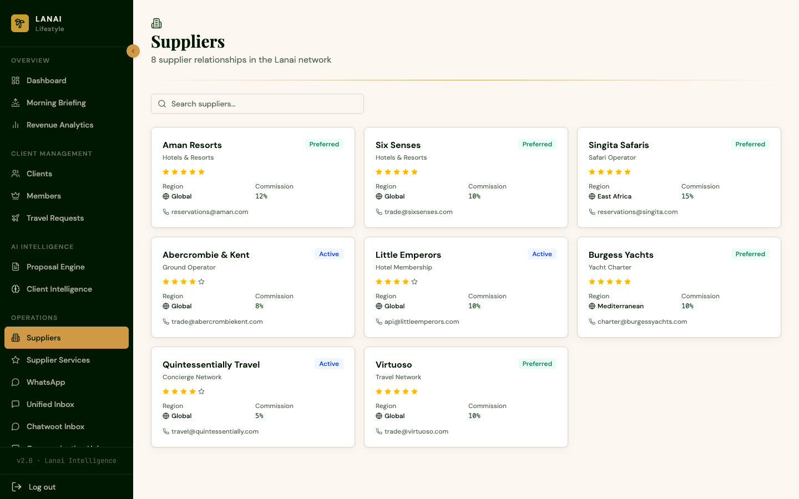

Your **vetted supplier network** covering hotels, villas, yachts, jets, transfers, and experiences.

**How to use it:** Browse suppliers, see their category, location, rating, preferred status, and contact details.

---

### 3.15 Supplier Services (Service Offerings)

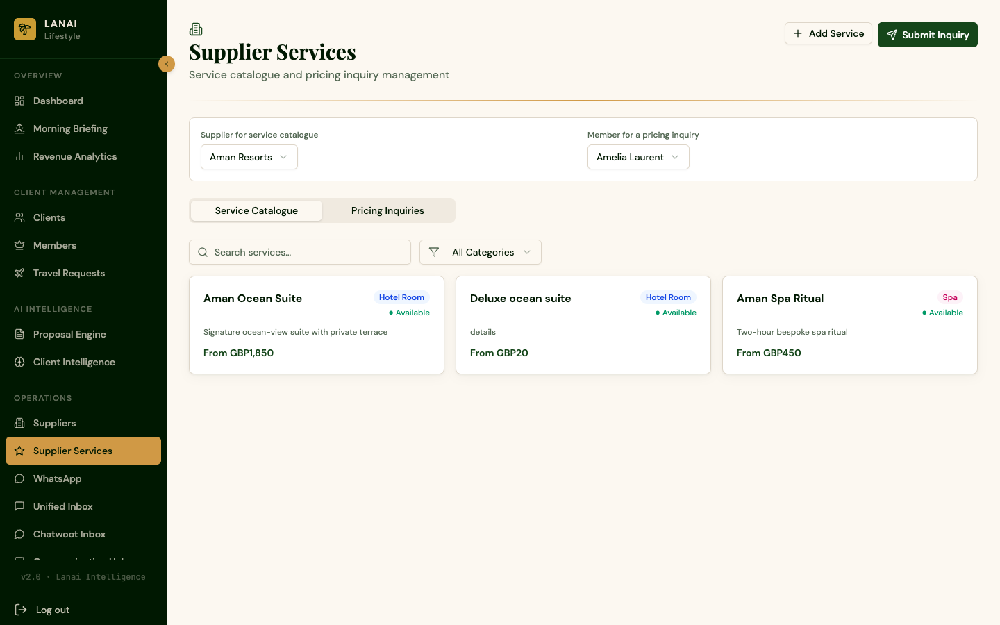

The **services each supplier provides** (rooms, dining, experiences, and more).

**How to use it:** Add a service to a supplier, or submit an inquiry for a service you need for a client.

---

### 3.16 Settings (Platform Configuration)

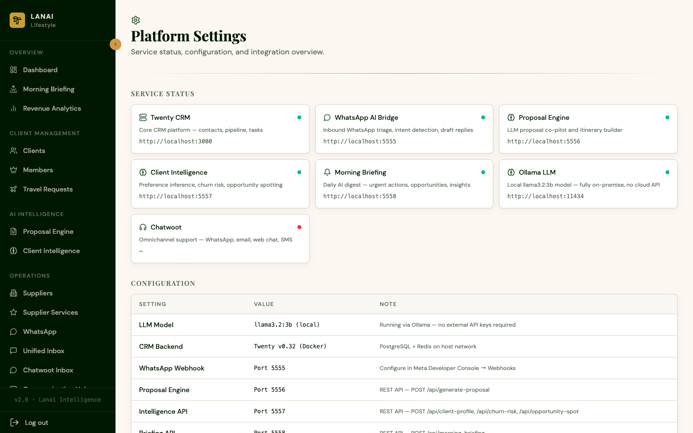

Your **account and platform settings** covering profile details, preferences, and system configuration.

---

## 4. AI Services: What to Expect

The platform uses a **local AI assistant** to help you work faster. Here are the plain-English guidelines:

- **AI is a helper, not a replacement.** It drafts proposals, briefings, and replies that you should **review and personalise** before sending.
- **It uses the facts you give it.** The more accurate your client details, the better the output.
- **It labels its assumptions.** AI never claims availability, prices, or supplier confirmations unless you provide them.
- **Generation takes a little time.** Complex proposals can take a minute or two, which is normal.

---

## 5. The Member Portal (for travellers)

The Member Portal is your **private space** to manage your travel with Lanai.

### 5.1 Trip Dashboard
Your personal overview showing your **active and upcoming trips**, their status, and quick access to your documents and proposals.

### 5.2 Proposals
View the **proposals** your advisor prepared for you, including accommodation, itinerary, experiences, and investment, in a clean, client-ready format. You can review and respond.

### 5.3 Documents
Access your **travel documents** (itineraries, confirmations, and vouchers) in one secure place.

### 5.4 Billing
View your **invoices and payment status** for your trips.

### 5.5 Profile
Manage your **personal preferences**, such as favourite destinations, cabin class, room type, and dietary needs, so your advisor can tailor everything to you.

### 5.6 Messages
Chat securely with your advisor through the portal. **You will receive an instant reply around the clock** because the AI concierge acknowledges your message right away and routes it to your advisor, ensuring you are never left waiting.

---

## 6. Services at a Glance

| Service | Where | What it does |
|---------|-------|--------------|
| **Live CRM** | Advisor Portal | Every client and contact in one place |
| **AI Proposals** | Advisor Portal | Drafts complete client proposals in minutes |
| **AI Intelligence** | Advisor Portal | Analyses each client for opportunities & risks |
| **AI Morning Briefing** | Advisor Portal | Daily digest of priorities and follow-ups |
| **WhatsApp AI** | Advisor Portal | Triage + draft replies for WhatsApp messages |
| **Unified Inbox** | Advisor Portal | All client conversations in one place |
| **24/7 AI Auto-Reply** | Both portals | Instant AI replies to member messages, day or night |
| **Supplier Network** | Advisor Portal | Vetted hotels, yachts, jets, transfers & experiences |
| **Invoicing** | Advisor Portal | Client & commission invoices |
| **Analytics** | Advisor Portal | Revenue and pipeline at a glance |
| **Client Portal** | Members | Trips, documents, proposals, billing & preferences |

---

## 7. Frequently Asked Questions

**Q: I received a "Too many requests" message. What should I do?**  
A: This is a temporary safeguard. Wait a few minutes and try again.

**Q: How long does an AI proposal take?**  
A: Usually 1–2 minutes. The platform shows you when it is ready.

**Q: Can a client see my internal notes?**  
A: No. The client portal only shows what you choose to share (proposals, documents, trips, billing).

**Q: Where do WhatsApp messages appear?**  
A: In the **Inbox** and the **WhatsApp** page, with an AI-drafted reply ready for you.

**Q: Will members always get a reply?**  
A: Yes. The 24/7 AI concierge replies to every member message automatically, providing a personalised reply when available or a warm acknowledgment otherwise.

**Q: I cannot log in to the client portal.**  
A: Check your email and PIN. If you have forgotten your PIN, contact your advisor to resend an invitation.

---

## 8. Getting Help

- **Advisors:** Contact your platform administrator for access or support.
- **Members:** Your dedicated Lanai advisor is your first point of contact for anything in the portal.

---

*Lanai Lifestyle: Luxury travel, intelligently delivered.*\n